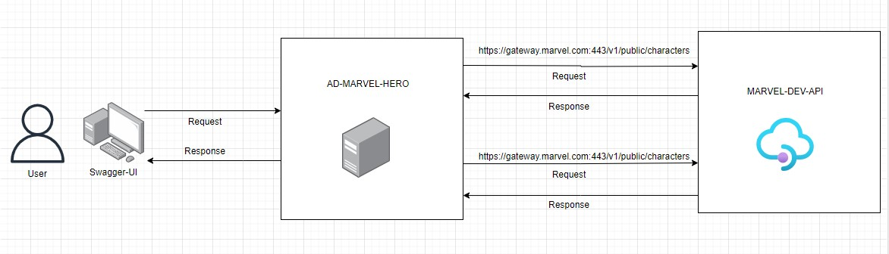

# ad-marvel-hero

An application to consume data from Marvel api and scan characters and comics data.


---

## Solution: 


A Springboot application is designed which will internally call the Marvel apis and perform the analysis. In order to start or refresh the analysis respective apis have been exposed.




---

## Run the app

### Requirements

For building and running the application you need:

 - JDK 17
 - Maven


---

### Run the application locally

There are several ways to run a Spring Boot application on your local machine. One way is to execute the main method in the `com.dev.ad_marvel_hero.AdMarvelHeroApplication` class from your IDE.
Alternatively you can use the Spring Boot Maven plugin like the following:
```cmd
mvn spring-boot:run
```

---

### Test the APIs

Use [Swagger-UI](http://localhost:8080/swagger-ui/index.html) to test the APIs.
```html
http://localhost:8080/swagger-ui/index.html
```

---

## APIs

The following apis have been exposed as part of the solution.


---

### 1. Start Analysis

This API will perform the analysis.

#### Request

```
[GET] /analysis/start
```

#### Response

```json
{
  "charactersCount": 1563,
  "comicsCountMap": {
    "Araña": 27,
    "Molecule Man": 10,
    "Changeling": 0,
    "Stacy X (Ultimate)": 2,
    "X-23": 291
  },
  "startTime": "2024-09-23 15:45:59",
  "endTime": "2024-09-23 15:48:24",
  "characterWithMultipleEntries": [
    "Jean Grey"
  ]
}
```

---

### 2. Get Comics count

This API will perform the analysis.

```
[GET] /analysis//comics/{character}/count
```

#### Response

```
4101
```


---

### 3. Refresh Analysis

This API will perform the redo the analysis.

#### Request

```
[GET] /analysis/refresh
```

#### Response

```json
{
  "charactersCount": 1563,
  "comicsCountMap": {
    "Araña": 27,
    "Molecule Man": 10,
    "Changeling": 0,
    "Stacy X (Ultimate)": 2,
    "X-23": 291
  },
  "startTime": "2024-09-23 15:45:59",
  "endTime": "2024-09-23 15:48:24",
  "characterWithMultipleEntries": [
    "Jean Grey"
  ]
}
```

---

## Marvel API

Developer API Portal: [https://developer.marvel.com/docs](https://developer.marvel.com/docs)

Please note: a Public Key and a Private Key needs to be generated from the portal in order to invoke the apis.

Characters API : Character names of Marvel Heroes
```
[GET] /v1/public/characters
```

Comics API : Information about comics and its characters.
```
[GET] /v1/public/comics
```